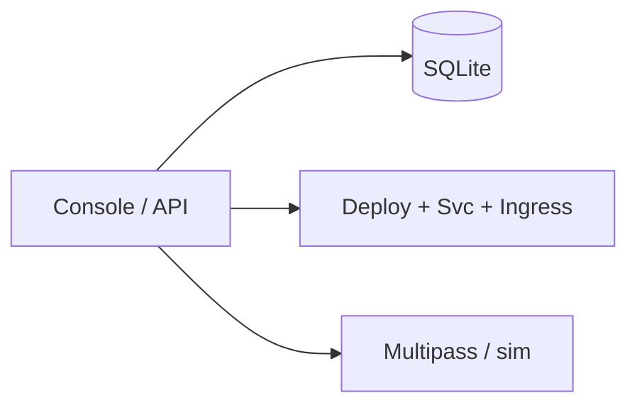
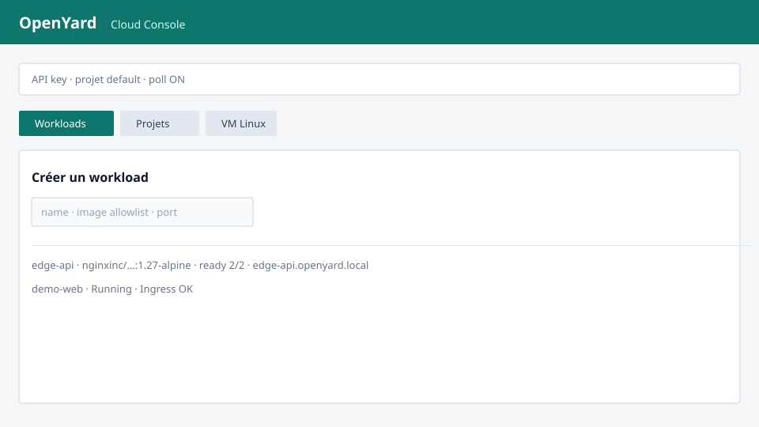

# OpenYard

[](https://github.com/Curtis736/openyard/actions)
[](LICENSE)

**Open cloud** open source : site web + console + API.

- **Workloads** : image Docker → Deployment + Service + Ingress → pods
- **Projets (tenants)** : namespace `oy-*`, quotas pods/CPU/RAM, clé API
- **VM Linux** : Ubuntu 22.04 / 24.04 (driver `sim` ou **Multipass**)
- **Persistance** : SQLite (`OPENYARD_DB`)
- **CI** : lint, tests, kubeconform, Trivy, **e2e kind**

Plan de contrôle, démos, RBAC et quotas tournent sur **kind** — sans facture cloud.

Docs : [Architecture](docs/ARCHITECTURE.md) · [Sécurité](docs/SECURITY.md) · [Contribuer](docs/CONTRIBUTING.md)

## Architecture (aperçu)



Détail : [docs/ARCHITECTURE.md](docs/ARCHITECTURE.md).

## Idée

Un cloud managé cache le passage conteneur → orchestration (et IaaS). OpenYard
les rend lisibles :

1. Crée un **projet** (tenant) → namespace + quotas + `oy_…` API key
2. Console `/console` : Projets / Workloads / VM Linux
3. Workloads : Deployment + Service + Ingress `{name}.openyard.local`
4. Apply → pods Ready + URL HTTP via ingress-nginx
5. VM Linux Ubuntu : launch / start / stop / delete (sim ou Multipass)

## Site & console

| URL | Contenu |
| --- | --- |
| `/` | Landing OpenYard |
| `/console` | Projets + Workloads + VM Linux |



## Projets (multi-tenant)

```bash
curl -s -X POST http://127.0.0.1:8000/projects \
  -H 'content-type: application/json' \
  -d '{"name":"acme","pods_quota":10,"cpu_quota":"1","memory_quota":"1Gi"}'
# → api_key oy_…  (à garder) + namespace oy-acme

curl -s -H "X-API-Key: oy_…" http://127.0.0.1:8000/workloads
```

- Projet `default` : namespace `openyard`, clé vide → accès anonyme si pas d’`OPENYARD_API_KEY` admin
- Autres projets : namespace `oy-{name}`, ResourceQuota K8s si cluster ON

## API

| Méthode | Chemin | Description |
| --- | --- | --- |
| GET | `/health` | Liveness + mode cluster |
| GET | `/metrics` | Prometheus |
| GET | `/stats` | Workloads / pods / projets (scopé) |
| POST | `/projects` | Créer un tenant (clé API renvoyée) |
| GET | `/projects` | Lister (sans secrets) |
| GET | `/projects/{name}` | Détail (clé si autorisé) |
| DELETE | `/projects/{name}` | Supprimer tenant + ressources |
| POST | `/workloads` | Enregistrer (`apply: true` optionnel) |
| GET | `/workloads` | Lister |
| GET | `/workloads/{name}` | Détail |
| POST | `/workloads/{name}/apply` | Appliquer sur le cluster |
| GET | `/workloads/{name}/status` | Statut pods (readyReplicas) |
| GET | `/workloads/{name}/manifest` | YAML Deployment + Service + Ingress |
| DELETE | `/workloads/{name}` | Retirer (et supprimer du cluster si appliqué) |
| GET | `/compute/images` | Catalogue VM Linux (Ubuntu) |
| POST | `/instances` | Lancer une VM Linux |
| GET | `/instances` | Lister |
| GET | `/instances/{name}/status` | Rafraîchir le statut |
| POST | `/instances/{name}/stop` | Arrêter |
| POST | `/instances/{name}/start` | Démarrer |
| DELETE | `/instances/{name}` | Supprimer |

Images acceptées : `ubuntu-22.04`, `ubuntu-24.04`, `ubuntu-lts` (Linux uniquement).

### Compute drivers

| `OPENYARD_COMPUTE` | Comportement |
| --- | --- |
| `auto` (défaut) | Multipass si installé, sinon `sim` |
| `sim` | VM Linux Ubuntu simulées (IP `10.88.0.x`) |
| `multipass` | Vraies VM Ubuntu via [Multipass](https://canonical.com/multipass) |
| `off` | Compute désactivé |

```bash
# Vraies VM Linux (mot de passe admin Homebrew) :
brew install --cask multipass
OPENYARD_COMPUTE=multipass make run
```

## Auth (optionnelle)

Si `OPENYARD_API_KEY` est défini, l’API exige le header `X-API-Key`
(sauf `/`, `/console`, `/assets`, `/health`, `/metrics`, `/docs`).

```bash
export OPENYARD_API_KEY='change-me'
make run
curl -s -H "X-API-Key: change-me" http://127.0.0.1:8000/workloads
```

Dans la console : champ **API key** (stocké en localStorage).

## Local (API + site)

```bash
python3 -m venv .venv
source .venv/bin/activate
pip install -r requirements-dev.txt
make lint test
make run
```

Ouvre http://127.0.0.1:8000/ puis http://127.0.0.1:8000/console

```bash
curl -s -X POST http://127.0.0.1:8000/workloads \
  -H 'content-type: application/json' \
  -d '{"name":"edge-api","image":"nginxinc/nginx-unprivileged:1.27-alpine","replicas":2,"port":8080}'
curl -s http://127.0.0.1:8000/workloads/edge-api/manifest
```

Sans kubeconfig, `/apply` répond `503` — normal hors cluster.

## Docker

```bash
make compose
# ou
docker compose up --build
```

Image GHCR : `ghcr.io/curtis736/openyard:latest`

## Kubernetes (kind)

```
k8s/base/           # plan de contrôle, RBAC, quotas, PDB, démos
k8s/overlays/kind/  # image locale openyard:local
scripts/kind-up.sh
```

```bash
make up
# site : http://openyard.local/  (Host header ou /etc/hosts)
curl -s -H 'Host: openyard.local' http://127.0.0.1:8080/health
kubectl -n openyard get pods,sa,role,resourcequota
```

`/etc/hosts` : `127.0.0.1 openyard.local` (et optionnellement `edge.openyard.local`)

Appliquer une charge depuis l’API (Ingress auto `{name}.openyard.local`) :

```bash
curl -s -X POST http://127.0.0.1:8080/workloads \
  -H 'Host: openyard.local' -H 'content-type: application/json' \
  -d '{"name":"edge","image":"nginxinc/nginx-unprivileged:1.27-alpine","port":8080,"apply":true}'
kubectl -n openyard get deploy,ingress,pods -l openyard.io/managed=true
curl -s -H 'Host: edge.openyard.local' http://127.0.0.1:8080/
make e2e
```

État persistant SQLite : `OPENYARD_DB` (défaut `data/openyard.db`, `/data/openyard.db` en cluster).

Détruire : `make down`

## Sécurité

- Pods non-root, `drop ALL`, seccomp `RuntimeDefault`
- Role limité au namespace `openyard` (deployments, services, pods, ingresses)
- ResourceQuota + LimitRange
- NetworkPolicy : ingress depuis `ingress-nginx`, egress DNS + API Kubernetes
- Token de ServiceAccount monté uniquement sur le plan de contrôle (pour apply)
- Auth API optionnelle : `OPENYARD_API_KEY` + header `X-API-Key`

## CI

GitHub Actions : Ruff, Pytest, Kustomize + kubeconform, **e2e kind**, build Docker,
Trivy, push GHCR sur `main`.

## Make

| Cible | Action |
| --- | --- |
| `make lint` / `make test` | Qualité |
| `make run` | API + site local sans cluster |
| `make up` / `make down` | kind |
| `make e2e` | smoke create/apply/ingress (cluster up) |
| `make compose` | Docker Compose |
| `make manifests` | `kustomize build` |

## Limites connues

- VM Linux `sim` = cycle de vie simulé ; Multipass = vraies Ubuntu hors pod kind
- Pas multi-tenant / pas facturation — volontairement minimal
