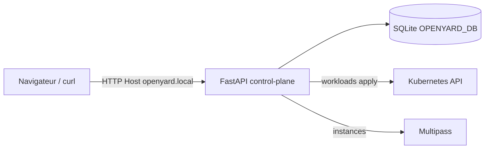
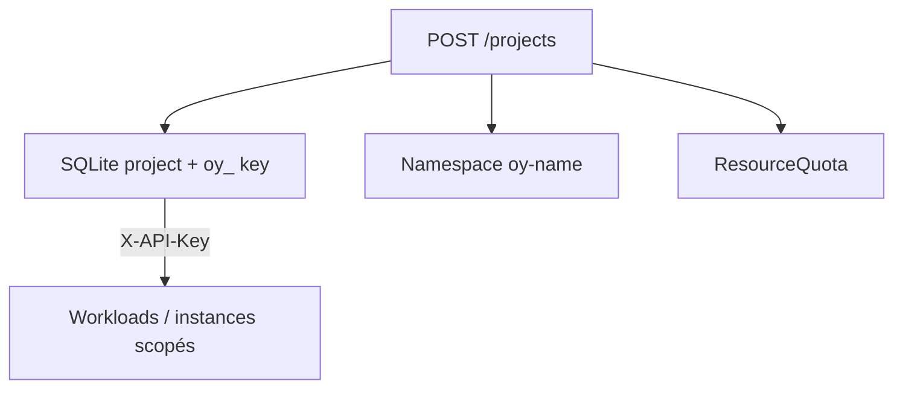

# Architecture OpenYard

OpenYard est un **mini plan de contrôle** : API FastAPI + SQLite +
drivers Kubernetes / Multipass, exposé via une console web française.

## Vue d’ensemble

## Multi-tenant

- Projet `default` → namespace `openyard` (anonyme si pas d’admin key)
- Autres projets → `oy-{name}` + clé `oy_…`
