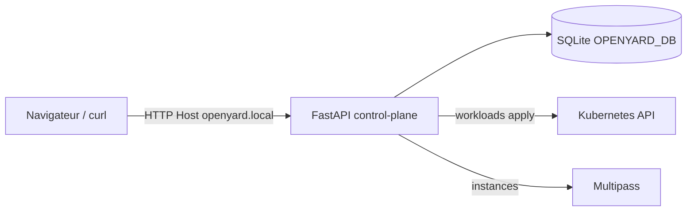
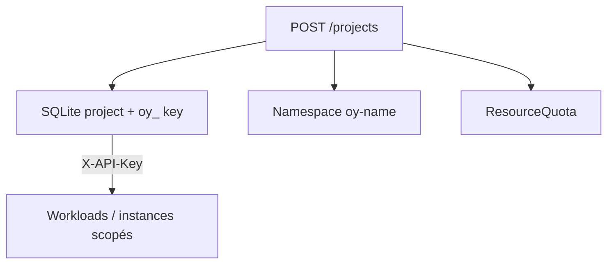
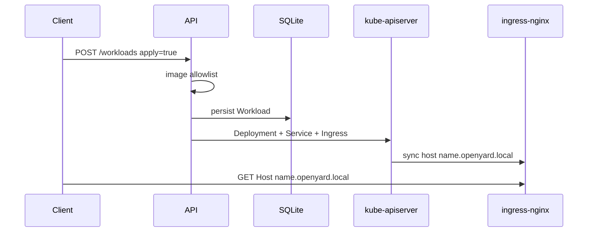

# Architecture OpenYard

OpenYard est un **mini plan de contrôle** : API FastAPI + SQLite +
drivers Kubernetes / Multipass, exposé via une console web française.

## Vue d’ensemble

## Multi-tenant

- Projet `default` → namespace `openyard` (anonyme si pas d’admin key)
- Autres projets → `oy-{name}` + clé `oy_…`

## Chemin d’un workload

## Compute (VM Linux)

| Driver | Où | Notes |
| --- | --- | --- |
| `sim` | Processus API | IP fictives `10.88.0.x`, idéal kind/CI |
| `multipass` | Hôte | Vraies Ubuntu via Multipass |
| `off` | — | Endpoints compute désactivés |

En cluster kind, `OPENYARD_COMPUTE=sim` (pas de Multipass dans le pod).

## Persistance

| Environnement | Stockage |
| --- | --- |
| Local | `data/openyard.db` (ou `OPENYARD_DB`) |
| Docker Compose | volume nommé `openyard-data` → `/data` |
| Kubernetes | **PVC** `openyard-data` (1Gi, RWO) monté sur `/data` |

Sans PVC, un `emptyDir` perdrait projets / workloads au restart du pod.

## Supply chain (images)

Module `app/image_policy.py` :

1. Tag obligatoire, `:latest` refusé
2. Préfixe dans `OPENYARD_ALLOWED_IMAGE_PREFIXES` (CSV)
3. Validation au `WorkloadCreate` (422 si refus)

Défauts : `nginxinc/`, `nginx:`, `hashicorp/`, `ghcr.io/curtis736/`, `registry.k8s.io/`.
